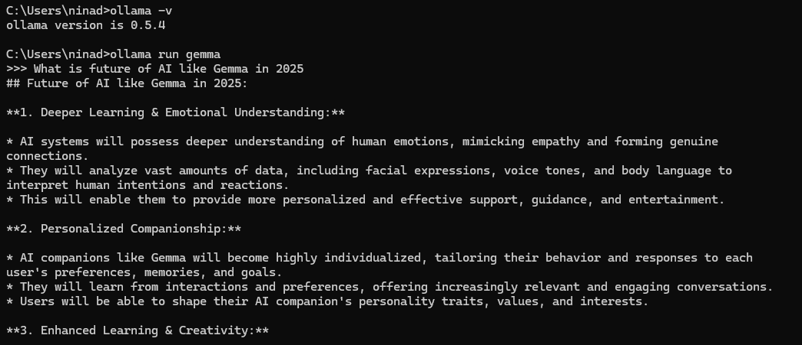

## Gemma
This is a family of lightweight, state-of-the-art open models built by Google DeepMind. Language models like Gemma, developed by Google DeepMind, are powerful tools for various AI applications, from text generation to code completion. 
If you're looking to run Gemma on your Windows machine, one of the simplest ways is by using Ollama, an open-source tool for running large language models locally.
This guide will walk you through the process step by step.

## Why Use Ollama?
Ollama simplifies the installation and running of LLMs by providing a user-friendly interface to pull and run models directly from the command line. It supports Gemma and other popular models like LLaMA and Mistral.


## Prerequisites
Before we begin, make sure you have the following:
- A Windows 10/11 machine (64-bit)
- Administrator privileges
- At least 16GB of RAM (for better performance)
- WSL (Windows Subsystem for Linux) – optional but recommended for smooth execution

### Step 1: Install Ollama

- Download the Installer
+ Visit the official Ollama download page.
+ Select the Windows version and download the .exe file.

- Run the Installer
+ Double-click the downloaded file to begin installation.
+ Follow the on-screen instructions to complete the setup.

- Verify Installation
+ Open Command Prompt or PowerShell and type:
```
ollama --version
```
If Ollama is installed successfully, the version number will appear.

### Step 2: Install Gemma LLM
-Pull Gemma Model
In Command Prompt or PowerShell, run the following command:
```
ollama install gemma
```
This will download the latest version of Gemma to your local machine.

Once downloaded, you can run the gemma using the below command:
```
ollama run gemma
```

### Sample Prompt
```
ollama run gemma p "What is future of AI like Gemma in 2025?"
```
### Screenshot from my Local


## Open Web UI
We can use Open Web UI to run a UI and interact with Ollama
We can use this command to start the Open Web UI:
```
docker run -d -p 3000:8080 --add-host=host.docker.internal:host-gateway -v open-webui:/app/backend/data --name open-webui --restart always ghcr.io/open-webui/open-webui:main

```


